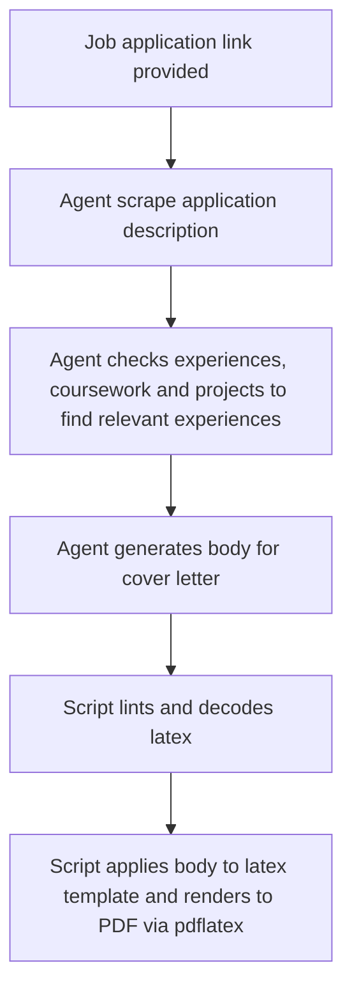

# customCoverLetters
Script to automate making PDF cover letters

This is a script I use personally to create custom cover letters. Works best if you host your agents on AWS Bedrock.

This script uses:
1. AWS Strands SDK
2. AWS Bedrock
3. Beautifulsoup (Frontend scraping)
4. pdflatex as a subprocess

### General Agent Workflow

